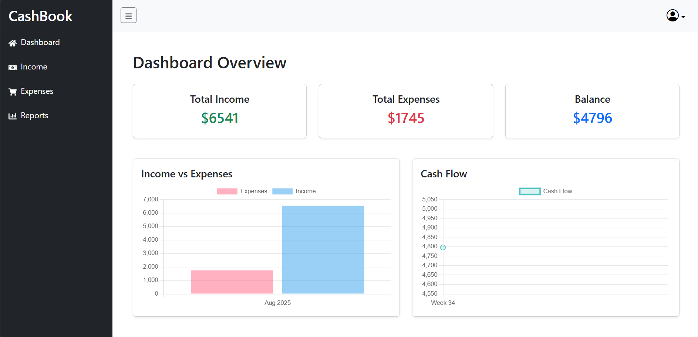
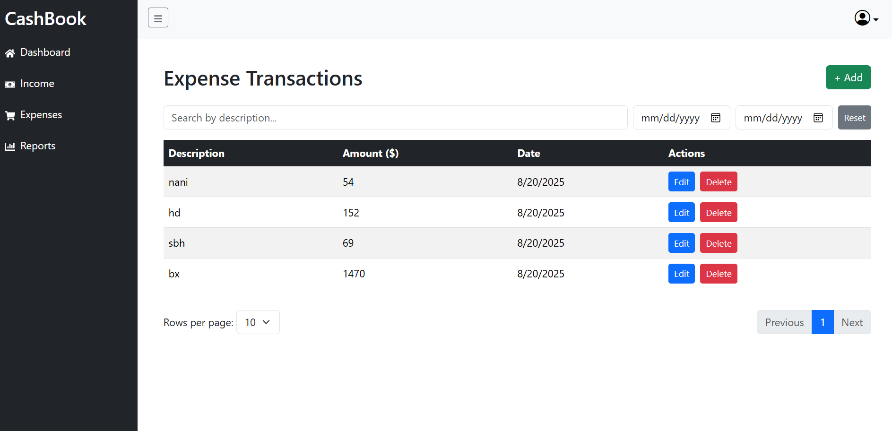
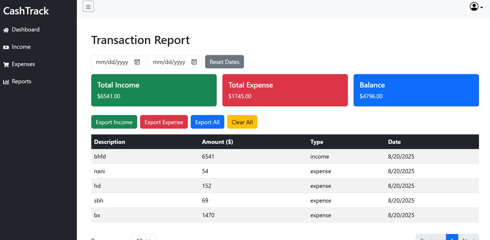
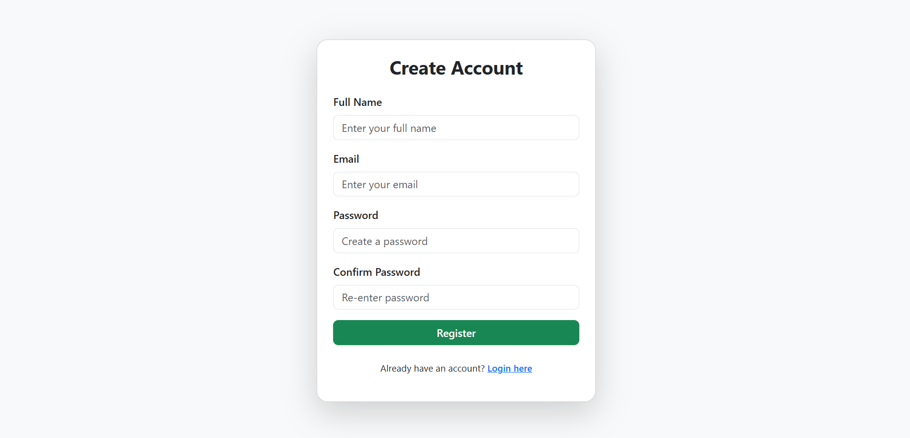
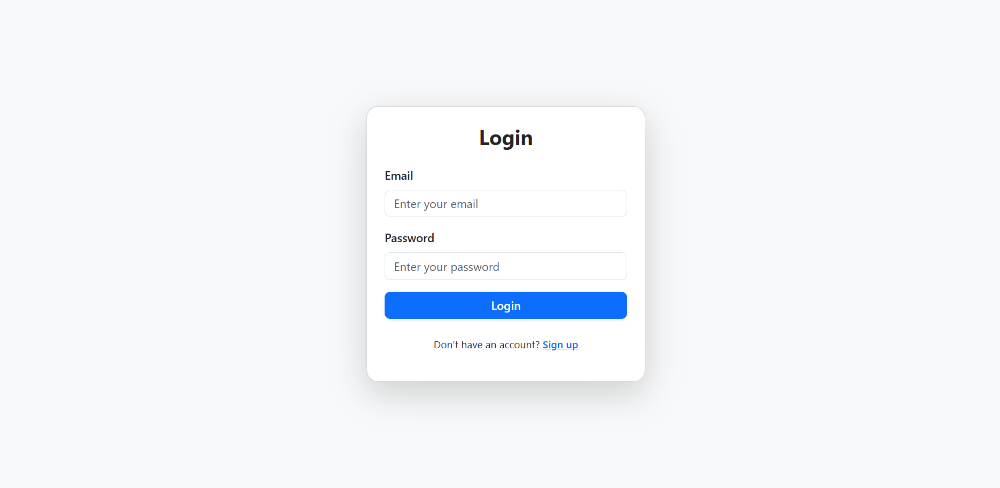

# CashTrack 💰

CashTrack is a simple cashbook web application built with **React**, **Node.js**, and **MySQL**.  
It helps users register/login, record their income and expenses, and generate reports with filters and export options.

---

## 📷 Screenshots
<p align="center">


</p>
<p align="center">


</p>
<p align="center">

</p>

---

## 🚀 Features

- 🔐 **Authentication** – Login & Registration system
- 📊 **Dashboard** – Overall balance summary with charts
- 💵 **Income Page** – Add, view, filter, and paginate income records
- 🧾 **Expense Page** – Add, view, filter, and paginate expense records
- 📑 **Report Page** – Export data (Excel/PDF), filter by date range, and clear data
- ⏩ **Pagination & Filters** – Easy navigation and date range search

---

## 🛠️ Tech Stack

- **Frontend:** React.js
- **Backend:** Node.js + Express
- **Database:** MySQL

---

## ⚙️ Setup & Installation

1. **Clone the repository**

   ```bash
   git clone https://github.com/your-username/cashtrack.git
   cd cashtrack
   ```

**Setup backend**

    cd backend
    npm install
    npm start

**Setup frontend**

    cd frontend
    npm install
    npm run dev

4. **Database setup**

   Import the SQL file (cashbook.sql) into MySQL

   Update backend/config/db.js with your DB credentials

📌 Improvements To Work On

    Add user profile and multi-user financial reports

    Improve charts with more insights

📜 License

This project is licensed under the MIT License.
